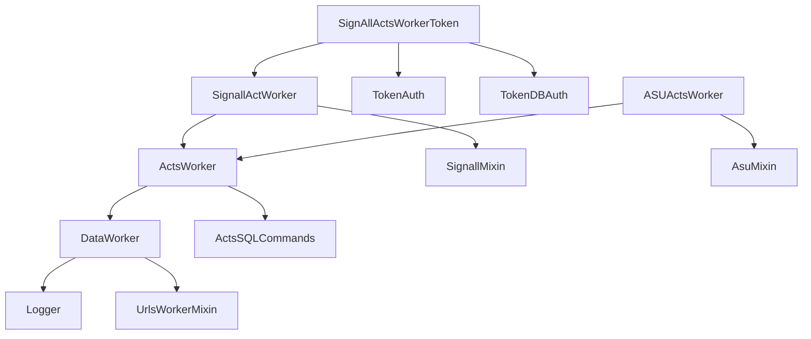

Архитектура и роли классов
==========================

Система построена из миксинов и воркеров. Миксины инкапсулируют общий
функционал (авторизация, логирование, SQL‑запросы, работа с фото/видео),
а воркеры объединяют их для конкретных задач.

Ключевые классы
--------------

### DataWorker
Базовый класс для отправки данных.
Отвечает за:
- получение данных (`get_send_data`),
- форматирование (`format_send_data`),
- отправку (`send_data`, `post_data`/`get_data`),
- логирование статуса в БД (`Logger`).

Типичная последовательность:
1. Получить запись из БД (`get_send_data`).
2. Отформатировать данные.
3. Логировать факт отправки и содержимое.
4. Отправить в REST API.
5. Сохранить внешний идентификатор.

### ActsWorker
Наследник `DataWorker` + SQL‑миксины:
- получает акты из таблицы `records`,
- фильтрует по времени/категориям,
- форматирует под целевую систему.

### SignallActWorker / SignAllActsWorkerToken
Интеграция с Signall:
- поддержка базовой авторизации и Token‑авторизации,
- отправка актов с фото/видео,
- обновление и удаление актов,
- импорт справочников (авто, перевозчики).

### SignAllKPPWorkerToken / SignAllKPPLiftsWorkerToken
Отправка проходов КПП и инцидентов:
- КПП: `kpp_arrivals`,
- Лифты/инциденты: `kpp_lifts`,
- фото/видео формируются в JSON‑структуры.

### ASUActsWorker / ASURoutesWorker
Интеграция с ASU:
- отправка актов с преобразованием времени в нужный TZ,
- получение маршрутов и контейнтеров (plan/fact),
- создание записи о маршруте в БД.

Композиция миксинов
-------------------

Миксины позволяют строить конкретные воркеры без дублирования:
- `AuthMe` / `TokenAuth` / `TokenDBAuth` — аутентификация.
- `UrlsWorkerMixin` — построение URL.
- `ActsSQLCommands` — SQL‑команды для актов.
- `Logger` — запись в `ex_sys_data_send_reports`.
- `PhotoEncoderMixin` / `SignallPhotoEncoderMixin` — base64 для фото.

Схема зависимостей (упрощённо):

