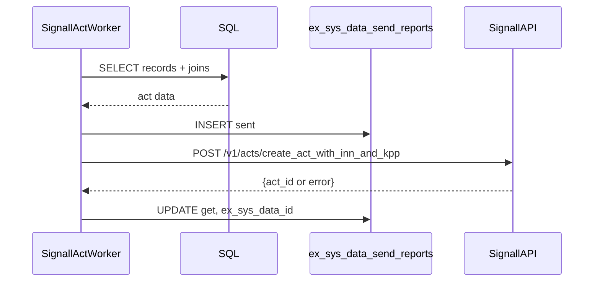

Потоки данных
=============

Отправка актов (Signall)
------------------------

КПП (проходы)
------------

`SignAllKPPWorkerToken` берет данные из `kpp_arrivals`, добавляет фото, 
формирует JSON и отправляет в `/v1/gravity/passes/create`.

КПП инциденты (лифты)
--------------------

`SignAllKPPLiftsWorkerToken` получает записи из `kpp_lifts`, добавляет
фото и видео (thumb), и отправляет в `/v1/gravity/passes/incidents/create`.

ASU (акты)
----------

`ASUActsWorker` подготавливает JSON, конвертирует время, отправляет в
`/extapi/v2/landfill-fact/`, затем загружает фото прибытия/убытия.

Логирование
-----------

Таблица `ex_sys_data_send_reports` хранит:
- `sent` — время отправки,
- `get` — время получения ответа,
- `ex_sys_data_id` — ID во внешней системе,
- `data` — сериализованный payload.
